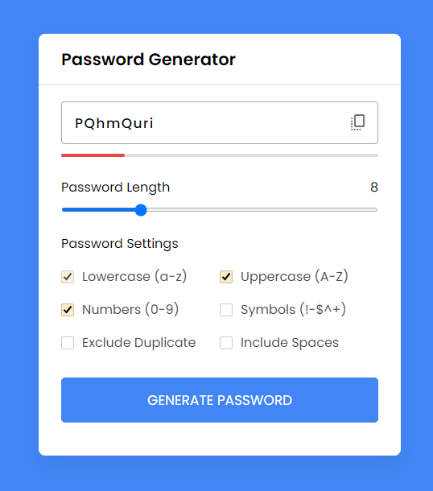
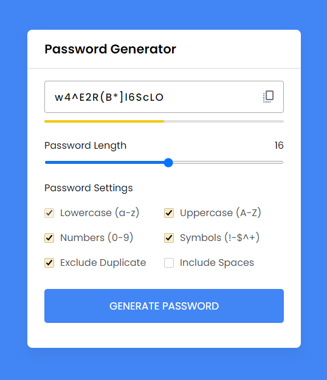
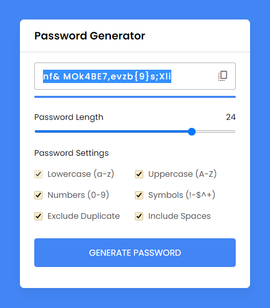

# Отчет по курсовой работе

#### Пользовательский интерфейс:
Страница с настраиваемым генератором паролей.

- **Слабо защищённый пароль**
- **Пароль средней сложности**
- **Мощный пароль**

Пользователь может генерировать пароль используя разные настройки пароля, такие как: прописные и заглавные буквы, цифры, символы, пробелы или же исключая повторения.

Менять сгенерированный пароль пользователь может по нажатию на кнопку. Также пользователь может изменять длину пароля используя ползунок над настройками пароля.

#### API сервера и хореография:

Сервер работает с помощью AJAX-запросов и Google APIs.

При нажатии на кнопку "Generate Password" index.php посылает запрос в script,js для создания нового пароля с заданными параметрами. 

При перемещении ползунка меняется количество символов в пароле, это также приводит к генерации его новой версии.

### Программный код, реализующий систему

Код реализующий генерацию пароля:
```js
const generatePassword = () => {
    let staticPassword = "",
    randomPassword = "",
    excludeDuplicate = false,
    passLength = lengthSlider.value;

    options.forEach(option => { // перебирая флажки каждого варианта
        if(option.checked) { //если флажок установлен
            // если id флажка не дублируется и пробелы
            if(option.id !== "exc-duplicate" && option.id !== "spaces") {
                // добавление определенного значения ключа из объекта character в staticPassword
                staticPassword += characters[option.id];
            } else if(option.id === "spaces") { // если id чекбокса - пробел
                staticPassword += `  ${staticPassword}  `; // добавление пробела в staticPassword
            } else { // иначе передать значение true в excludeDuplicate
                excludeDuplicate = true;
            }
        }
    });

    for (let i = 0; i < passLength; i++) {
        // получение случайного символа из статического пароля
        let randomChar = staticPassword[Math.floor(Math.random() * staticPassword.length)];
        if(excludeDuplicate) { // если excludeDuplicate = true
            // если randomPassword не содержит текущего случайного символа или randomChar равен пробелу " ", то добавим случайный символ в randomPassword иначе уменьшите i на -1
            
            !randomPassword.includes(randomChar) || randomChar == " " ? randomPassword += randomChar : i--;
        } else { // иначе добавить случайный символ в randomPassword
            randomPassword += randomChar;
        }
    }
    passwordInput.value = randomPassword; // передача randomPassword в значение passwordInput
}
```